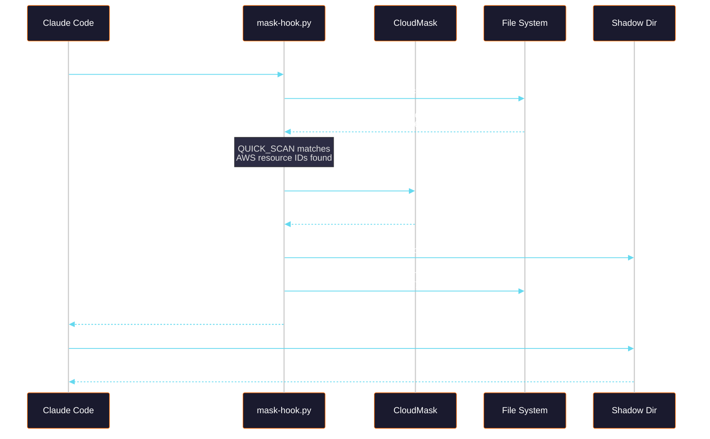
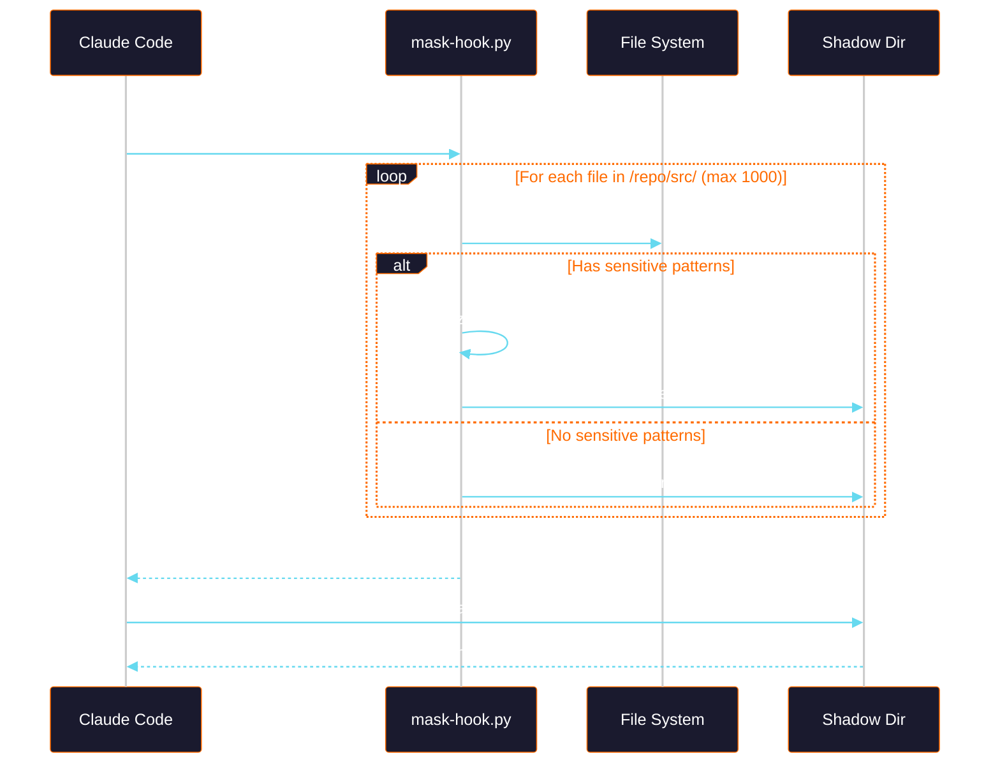
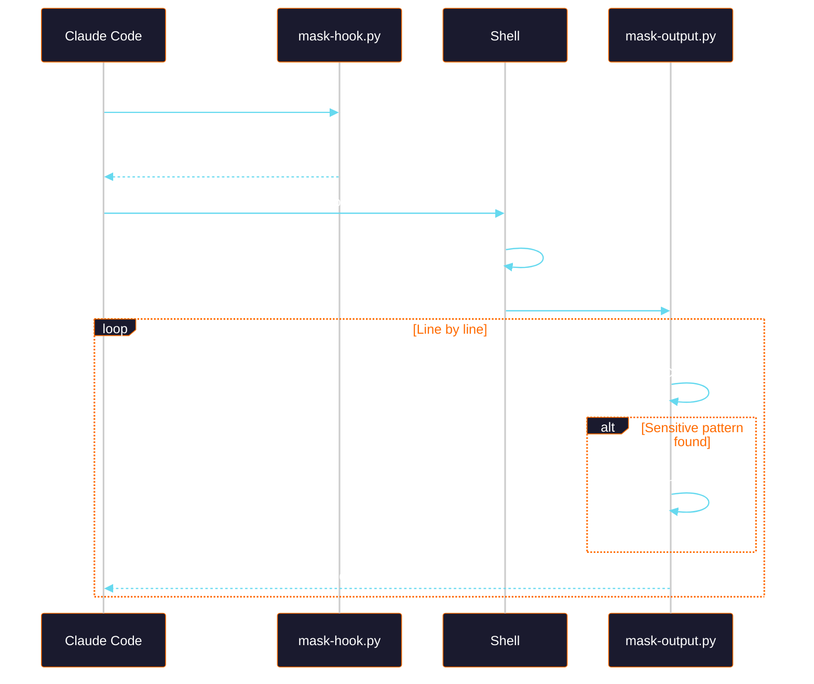
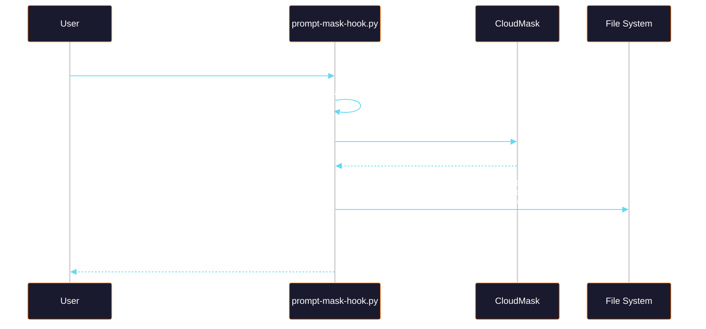

# CloudMask Hooks for Claude Code

CloudMask hooks form a transparent anonymization layer between Claude Code and your codebase. AWS infrastructure identifiers (resource IDs, account IDs, ARNs, IPs) are masked before Claude sees them and restored when Claude writes back.

## Architecture Overview


### Hook Files

| File | Event | Purpose |
|------|-------|---------|
| `mask-hook.py` | PreToolUse | Anonymizes content before Claude reads it |
| `demask-hook.py` | PostToolUse | Restores real values after Claude writes |
| `mask-output.py` | (Bash pipe) | Anonymizes command output line-by-line |
| `prompt-mask-hook.py` | UserPromptSubmit | Blocks prompts containing real IDs |
| `_hook_common.py` | (shared) | Seed, crypto, mapping I/O, logging |

### Tool Coverage

| Tool | PreToolUse (mask) | PostToolUse (demask) |
|------|:-:|:-:|
| **Read** | Redirect to shadow copy | -- |
| **Write** | Redirect to shadow if exists | Unanonymize shadow OR real file |
| **Edit** | Redirect to shadow if exists | Unanonymize shadow OR real file |
| **Grep** | Redirect search to shadow dir | -- |
| **Bash** | Wrap output through masker pipe | -- |
| **UserPrompt** | -- (prompt-mask-hook blocks) | -- |

---

## Flow Diagrams

### Read Flow

When Claude reads a file, the hook intercepts it, creates an anonymized shadow copy, and redirects Claude to read the shadow instead.



**Example:**

```
# Real file: /repo/main.tf
resource "aws_instance" "web" {
  ami           = "ami-0abcdef1234567890"
  instance_type = "t3.micro"
  subnet_id     = "subnet-0abc1234d5e6f789"
  vpc_security_group_ids = ["sg-0def9876c5b4a321"]
}

# What Claude sees (shadow copy):
resource "aws_instance" "web" {
  ami           = "ami-e4f7a29b31c86d50"
  instance_type = "t3.micro"
  subnet_id     = "subnet-b8c3d1e7f9024a56"
  vpc_security_group_ids = ["sg-71a940de5fc82b36"]
}
```

### Write / Edit Flow

When Claude writes or edits, the demask-hook restores real values. This handles two cases: writing to shadow files (redirected writes) and writing new files (CSVs, reports).

```mermaid
%%{init: {'theme': 'dark', 'themeVariables': {'primaryColor': '#ff6b00', 'primaryTextColor': '#ffffff', 'primaryBorderColor': '#ff8c33', 'lineColor': '#66d9ef', 'secondaryColor': '#1a1a2e', 'tertiaryColor': '#16213e', 'noteBkgColor': '#2d2d44', 'noteTextColor': '#e0e0e0', 'actorBkg': '#1a1a2e', 'actorBorder': '#ff6b00', 'actorTextColor': '#ffffff', 'signalColor': '#66d9ef', 'signalTextColor': '#ffffff', 'labelBoxBkgColor': '#1a1a2e', 'labelBoxBorderColor': '#ff6b00', 'labelTextColor': '#ffffff', 'loopTextColor': '#ff6b00', 'activationBkgColor': '#2d2d44', 'activationBorderColor': '#ff8c33', 'sequenceNumberColor': '#ffffff'}}}%%

sequenceDiagram
    participant CC as Claude Code
    participant MH as mask-hook.py
    participant DH as demask-hook.py
    participant SH as Shadow Dir
    participant FS as Real File

    rect rgb(30, 40, 60)
        Note over CC,FS: Case 1: Editing an existing file (shadow redirect)
        CC->>MH: PreToolUse Write<br/>file_path: /repo/config.tf
        Note over MH: Shadow exists for this file
        MH-->>CC: updatedInput:<br/>file_path: shadow/.../config.tf
        CC->>SH: Write to shadow file
        CC->>DH: PostToolUse Write<br/>file_path: shadow/.../config.tf
        Note over DH: Is shadow path? Yes
        DH->>SH: Read shadow content
        DH->>DH: Load reverse mapping<br/>Resolve chains<br/>Unanonymize
        DH->>FS: Atomic write to /repo/config.tf<br/>(real values restored)
    end

    rect rgb(40, 30, 50)
        Note over CC,FS: Case 2: Creating a new file (CSV, report)
        CC->>MH: PreToolUse Write<br/>file_path: /repo/output.csv
        Note over MH: No shadow exists
        MH-->>CC: (pass through)
        CC->>FS: Write /repo/output.csv<br/>(contains anonymized IDs)
        CC->>DH: PostToolUse Write<br/>file_path: /repo/output.csv
        Note over DH: Not shadow, but check<br/>for anonymized tokens
        DH->>FS: Read /repo/output.csv
        DH->>DH: Load reverse mapping<br/>Check for anon tokens<br/>Unanonymize in-place
        DH->>FS: Atomic write /repo/output.csv<br/>(real values restored)
    end
```



**Example — new CSV file:**

```csv
# What Claude writes (anonymized IDs):
id,instance_id,status
1,i-a1b2c3d4e5f67890,running
2,i-f9e8d7c6b5a43210,stopped

# What ends up on disk (demask-hook restores):
id,instance_id,status
1,i-0abc1234d5e6f789,running
2,i-0def9876c5b4a321,stopped
```

### Grep Flow

Grep is redirected to search shadow copies so Claude never sees real IDs in search results.



**Example:**

```
# Claude searches for "vpc-" — results come from shadow:

shadow/.../deploy.tf:3:  vpc_id = "vpc-a1b2c3d4e5f67890"
shadow/.../network.py:17:  vpc = "vpc-a1b2c3d4e5f67890"

# Real IDs (vpc-0abc1234d5e6f789) never appear in results
```

### Bash Flow

Bash commands are wrapped to pipe output through `mask-output.py`.



**Example:**

```bash
# Original command output:
$ aws ec2 describe-vpcs --query 'Vpcs[].VpcId'
[
    "vpc-0abc1234d5e6f789",
    "vpc-0def9876c5b4a321"
]

# What Claude sees (after mask-output.py):
[
    "vpc-a1b2c3d4e5f67890",
    "vpc-f9e8d7c6b5a43210"
]
```

### Prompt Blocking Flow

User prompts containing real AWS IDs are blocked before reaching Claude.



**Example interaction:**

```
> Fix the security group on vpc-0abc1234d5e6f789

CloudMask blocked this prompt — detected: resource IDs (vpc)
Masked version saved. Resubmit with:

  @~/.cloudmask/.blockedprompts/20260312-142500-a3f7c1.txt

Or copy the masked prompt:

  Fix the security group on vpc-a1b2c3d4e5f67890
```

---

## Complete Lifecycle

End-to-end flow showing all hooks working together:


---

## Seed Resolution

The seed determines all anonymization. Resolved in priority order:

```
1. OS Keychain     keyring.get_password("cloudmask", "seed")
2. Seed File       ~/.cloudmask/seed  (perms: 0400)
3. Environment     $CLOUDMASK_SEED
```

If no seed is found, `mask-hook.py` emits a `block` decision (fail-closed).

## Mapping File

Encrypted at rest with Fernet (AES-128 + HMAC). Key derived via PBKDF2-SHA256 with 100K iterations and a deterministic salt (from seed hash). This allows `@lru_cache` — PBKDF2 runs once per process.

```json
{
  "_metadata": {
    "seed_hash": "a3f7c1d9e2b84056",
    "version": "1.0"
  },
  "mappings": {
    "vpc-0abc1234d5e6f789": "vpc-a1b2c3d4e5f67890",
    "i-1234567890abcdef0":   "i-1234567890abcdef0",
    "123456789012":          "948271635084"
  }
}
```

Stored encrypted at `~/.cloudmask/hooks/mapping.json`. Concurrent access is serialized via `fcntl.flock` on `mapping.json.lock` (exclusive for writes, shared for reads).

## Shadow File Layout

```
~/.cloudmask/hooks/shadow/
  Users/
    sam/
      repos/
        myapp/
          src/
            config.tf        # Anonymized copy (sensitive content)
            utils.py -> /Users/sam/repos/myapp/src/utils.py  # Symlink (no sensitive content)
          deploy/
            main.tf          # Anonymized copy
```

- **Anonymized copies** — files where `QUICK_SCAN` matched (have real AWS IDs)
- **Symlinks** — files without sensitive content (Grep needs them for complete search results)

## Logging

All hooks log to `~/.cloudmask/logs/hooks.log` with 25MB rotation (3 backups).

```
2026-03-12 14:24:48,253 [cloudmask.hooks.mask] DEBUG Read: /repo/config.tf
2026-03-12 14:24:48,307 [cloudmask.hooks.mask] INFO  Anonymized /repo/config.tf -> shadow/... (11 mappings)
2026-03-12 14:24:48,307 [cloudmask.hooks.mask] INFO  Read: redirected to shadow ...
2026-03-12 14:24:55,060 [cloudmask.hooks.mask] INFO  Grep: redirected dir to shadow ... (42 files)
2026-03-12 14:25:01,490 [cloudmask.hooks.demask] INFO  Restored shadow/... -> /repo/config.tf (22 reverse mappings)
2026-03-12 14:25:01,613 [cloudmask.hooks.prompt-mask] DEBUG No sensitive patterns in prompt, passing through
```

## Installation

```bash
# Interactive install (generates seed, copies hooks, updates settings)
python3 scripts/install-hooks.py

# Non-interactive with specific seed
python3 scripts/install-hooks.py --seed my-secret-seed-here

# Check status
python3 scripts/install-hooks.py --status

# Uninstall
python3 scripts/install-hooks.py --uninstall
```

## Known Limitations

| Limitation | Detail |
| --- | --- |
| Grep path display | Search results show `~/.cloudmask/hooks/shadow/...` paths instead of real paths |
| File size cap | Files > 10 MB are passed through unmasked |
| Extension filter | Only files with recognized extensions are anonymized (binaries, images skipped) |
| Shadow file count | Grep walks max 1000 files per directory |
| Subshell wrapping | Bash commands run in `( )` subshell — `cd` and `export` won't propagate |
